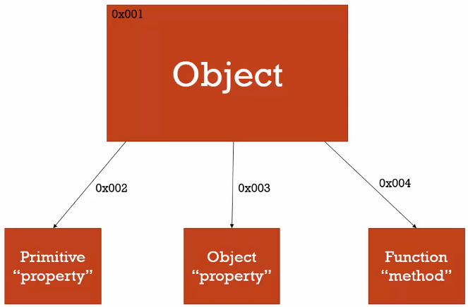

# Discovering JavaScript

1. [JavaScript Snippets](docs/javascript_snippets.md)
1. [JavaScript Resources](docs/resources.md)

## Definitions & Concepts

### Declaring and defining

`var x;` is a **declaration** because you are not defining what value it holds but you are declaring its existence and the need for memory allocation.

`var x = 1;` is both **declaration** and **definition** but are separated with x being declared in the beginning while its definition comes at the line specified (variable assignments happen inline).

### Context

- Context is always the value of the `this` keyword which is a reference to the object that "owns" the currently executing code.
- Conext is most often determined by how a function is invoked.
  - When a function is called as a method of an object, `this` is set to the object the method is called on
- Object based

#### Method of an object

```js
var obj = {
  foo: function () {
    return this;
  },
};
obj.foo() === obj; // true
```

#### Using `new`

```js
function foo() {
  alert(this);
}
foo(); // window
new foo(); // foo
```

### Scope

- Pertains to the variable access of a function when it is invoked and is unique to each invocation
- A variable can be defined in either local or global scope, which establishes the variables' accessibility from different scopes during runtime.
- Any defined global variable, meaning any variable declared outside of a function body will live throughout runtime and can be accessed and altered in any scope.
- Local variables exist only within the function body of which they are defined and will have **a different scope for every call of that function**. There it is subject for value assignment, retrieval, and manipulation only within that call and is not accessible outside of that scope.
- Function based

### Operator

- An operator performs some operation on single or multiple operands (data value) and produces a result. For example 1 + 2, where + sign is an operator and 1 is left operand and 2 is right operand. + operator adds two numeric values and produces a result which is 3 in this case.

1. Arithmetic Operators
1. Comparison Operators
1. Logical Operators
1. Assignment Operators
1. Conditional Operators

#### Conditional (ternary) operator

> The conditional (ternary) operator is the only JavaScript operator that takes three operands: a condition followed by a question mark (?), then an expression to execute if the condition is truthy followed by a colon (:), and finally the expression to execute if the condition is falsy. This operator is frequently used as a shortcut for the if statement.

```js
function getFee(isMember) {
  return isMember ? "$2.00" : "$10.00";
}

console.log(getFee(true));
// expected output: "$2.00"

console.log(getFee(false));
// expected output: "$10.00"

console.log(getFee(null));
// expected output: "$10.00"
```

### Expression

An expression is any valid set of literals, variables, operators, and expressions that evaluates to a single value. The value may be a number, a string, or a logical value. Conceptually, there are two types of expressions: those that assign a value to a variable, and those that simply have a value. For example, the expression

x = 7

is an expression that assigns x the value 7. This expression itself evaluates to 7. Such expressions use assignment operators. On the other hand, the expression

3 + 4

simply evaluates to 7; it does not perform an assignment. The operators used in such expressions are referred to simply as operators.

JavaScript has the following kinds of expressions:

1. Arithmetic: evaluates to a number, for example
1. String: evaluates to a character string, for example "Fred" or "234"
1. Logical: evaluates to true or false.

The special keyword null denotes a null value. In contrast, variables that have not been assigned a value are undefined, and cannot be used without a run-time error.

### Statement

???

### Invocation

- Running a function
- In JavaScript, using parenthesis ()

### Syntax Parser

- A program that reads your code and determines what it does and if its grammar is valid.
- Your code isn't magic. Someone else wrote a program to translate it for the computer.

### Lexical Environment

- Where something sits physically in the code you write
- 'Lexical' means 'having to do with the words or grammar'. A lexical environment exists in programming languages in which where you write something is important.
- There are lots of lexical environments. Which one is currently running is managed via execution contexts. It can contain things beyond what you've written in your code.

### Environments

- When code is run in JavaScript, the environment in which it is executed is very important, and is evaluated as 1 of the following:

1. Global code - the default environment where your code is executed for the first time
1. Function code - Whenever the flow of execution enters a function body
1. Eval code - Text to be executed inside the internal eval function

### Execution Context

- The current environment/scope the current code is being evaluated in
- Everytime a function is called, a new **execution context** is created
- There are 2 phases in JavaScript's execution context
  1. Creation phase - when the function is called, but before it executes any code inside
     1. Create the Scope Chain
     1. Create variables, function and arguments
     1. Determine the value of `this`
  1. Execution phase
     1. Assign values, references to functions and interpret / execute code
- An execution context can be divided into a creation and execution phase. In the creation phase, the interpreter will first create a variable object (also called an activation object) that is composed of all the variables, function declarations, and arguments defined inside the execution context. From there the scope chain is initialized next, and the value of `this` is determined last. Then in the execution phase, code is interpreted and executed.
- It is possible to represent each **execution context** conceptually as an object with 3 properties:

```js
executionContextObj = {
  scopeChain: {
    /* variableObject + all parent execution context's variableObject */
  },
  variableObject: {
    /* function arguments / parameters, inner variable and function declarations */
  },
  this: {},
};
```

- During the first pass, compilation/creation, all variables are set to undefined
  - Don't set variables to 'undefined'. Will help in debugging.

#### When does a function end?

- When it encounters a return statement or it encounters a closing bracket `}`
- When a function ends, the following happens
  1. The local execution contexts pop off the execution stack
  1. The functions send the return value back to the calling context. The calling context is the execution context that called this function, it could be the global execution context or another local execution context. It is up to the calling execution context to deal with the reeturn value at that point. The returned value could be an object, an array, a function, a boolean, anything really. If the function has no return statement, `undefined` is returned.
  1. The local execution context is destroyed. This is important. Destroyed. All the variables that were declared within the local execution context are erased. They are no longer available. That's why they're called local variables.

#### Pseudo-overview of how the interpreter evalutes the code

1. Find some code to invoke a function
1. Before executing the function code, create the **execution context**
1. Enter the **Creation Stage**
   1. Initialize the **Scope Chain**
   1. Create the `variableObject`
      1. Create the `arguments` object, check the context for parameters, initialize the name and value and create a reference copy
      1. Scan the context for function declarations:
         1. For each function found, create a property in the `variableObject` taht is the excact function name, which has a reference pointer to the function in memory
         1. If the function name exists already, the reference pointer value will be overwritten
      1. Scan the context for variable declarations:
         1. For each varaible declaration found, create a property in the `variableObject` that is the variable name, and initialize the value as `undefined`
         1. If the variable name already exists in the `variableObject`, do nothing and continue scanning
   1. Determine the value of `this` inside the context
1. Activation / Code **Execution Stage**
   1. Run / interpret the function code in the ontext and assign varaible values as the code is ececuted line by line

Example:

```js
function foo(i) {
  var a = "hello";
  var b = function privateB() {
    // do something
  };
  function c() {}
}
foo(22);
```

On calling `foo(22)` the **creation stage** looks as follows:

```js
fooExecutionContext = {
  scopeChain: { ... },
  variableObject: {
    arguments: {
      0: 22,
      length: 1
    },
    i: 22,
    c: pointer to function c(),
    a: undefined,
    b: undefined
  },
  this: { ... }
}
```

As you can see the **creation stage** handles defining the names of the properties, not assigning a value to them, with the exception of formal arguments/parameters. Once the **creation stage** has finished, the flow of execution enters the function and the activation / code **execution stage** looks like this after the function has finished execution:

```js
fooExecutionContext = {
  scopeChain: { ... },
  varaibleObject: {
    arguments: {
      0: 22,
      length: 1
    },
    i: 22,
    c: pointer to function c(),
    a: 'hello',
    b: pointer to function privateB()
  },
  this: { ... }
}
```

Example 2

```js
​(function() {

    console.log(typeof foo); // function pointer
    console.log(typeof bar); // undefined

    var foo = 'hello',
        bar = function() {
            return 'world';
        };

    function foo() {
        return 'hello';
    }

}());
```

The questions we can now answer are:

1. Why can we access foo before we have declared it?
   - If we follow the creation stage, we know the variables have already been created before the activation / code execution stage. So as the function flow started executing, foo had already been defined in the activation object.
1. Foo is declared twice, why is foo shown to be function and not undefined or string?
   - Even though foo is declared twice, we know from the creation stage that functions are created on the activation object before variables, and if the property name already exists on the activation object, we simply bypass the decleration.
   - Therefore, a reference to function foo() is first created on the activation object, and when the interpreter gets to var foo, we already see the property name foo exists so the code does nothing and proceeds.
1. Why is bar undefined?
   - bar is actually a variable that has a function assignment, and we know the variables are created in the creation stage but they are initialized with the value of undefined.

### Identifier Resolution and Closures in the JS Scope Chain

http://davidshariff.com/blog/javascript-scope-chain-and-closures/

- Every function has an associated **execution context** that contains a **variable object [VO]**, which is composed of all the variables, functions and parameters defined inside that given local function.
- The **scope chain** property of each **execution context** is simply a collection of the current context's **[VO]** plus all parent's lexical **[VO]**'s.

Scope = VO + All Parent VOs
eg: scopeChain = [[VO], + [VO1] + [VO2] + [VO n+1]];

- We now know that the first **[VO]** of the **scope chain** belongs to the current **execution context**, and we can find the remaining parent [VO]s by looking at the parent context's scope chain:

```js
function one() {
  two();
  function two() {
    three();
    function three() {
      alert("Im at function three");
    }
  }
}
one();
```

- We can see that the **scope chain** in this point in time looks as follows:
  `three() Scope Chain = [ [three() VO] + [two() VO] + [one() VO] + [Global VO] ];`

### Lexical Scope

- The JavaScript interpreter uses **Lexical Scoping**, as opposed to dynamic scoping. This means all inner functions are statically (lexically) boudn to the parent context in which the inner function was physically defined in the program code.

- In the previous example above, it doesn't matter in which sequence the inner functions are called. `three()` will always be statically bound to `two()`, which in turn will always be bound to `one()` and so on.
- This gives a chaining effect where all inner functions can access outer functions VO through the statically bound **Scope Chain**.
- This **lexical scope** is the source of confusion for many developers. We know that every invocation of a function will create a new **execution context** and associated **VO**, which holds the values of variables evaluated in the current context. It is this dynamic, runtime evaluation of the **VO** paired with the lexical (static) defined scope of each context that leads unexpected results in program behavior.

```js
var myAlerts = [];
for (var i = 0; i < 5; i++) {
  myAlerts.push(function inner() {
    alert(i);
  });
}
myAlerts[0](); //5
myAlerts[1](); //5
myAlerts[2](); //5
myAlerts[3](); //5
myAlerts[4](); //5
```

- Function **inner** was created in the global context, therefore its scope chain is statically bound to the global context.
- Invoking `inner()` by `myAlerts[x]()` looks in **inner.ScopeChain** to resolve **i**, which is located in the global context. At the time of each invocation, **i** has already been incremented to 5, giving the same result every time **inner()** is called. The statically bound scope chain, which holds [VOs] for each context containing live variables, often catches developers by surprise.

### Closures

> Here is how it works. Whenever you declare a new function and assign it to a variable, you store the function definition, as well as a closure. The closure contains all the variables that are in scope at the time of creation of the function. It is analogous to a backpack. A function definition comes with a little backpack. And in its pack it stores all the variables that were in scope at the time that the function definition was created.
> The key to remember is that when a function gets declared, it contains a function definition and a closure. The closure is a collection of all the variables in scope at the time of creation of the function.
> When a function returns a function, that is when the concept of closures becomes more relevant. The returned function has access to variables that are not in the global scope, but they solely exist in its closure.

- An inner function always has access to the vars and parameters of its outer function, even after the outer function has returned...
- Accessing variables outside of the immediate lexical scope creates a closure. In other words, a closure is formed when a nested function is defined inside of another function, allowing access to the outer functions varaibles.
- Returning the nested function allows you to maintain access to the local variables, arguments, and inner function declarations of its outer function.
- This encapsulation allows us to hide and preserve the execution context from outside scopes while exposing a public interface and thus is subject to further manipulation.

```js
function foo() {
  var a = "private variable";
  return function bar() {
    alert(a);
  };
}
var callAlert = foo();
callAlert(); // 'private variable'
```

- The **global context** has a function named `foo()` and a variable named `callAlert`, which holds the returned value of `foo()`.

```js
// Global Context when evaluated
global.VO = {
  foo: pointer to foo(),
  callAlert: returned value of global.VO.foo
  scopeChain: [global.VO]
}

// Foo Context when evaluated
foo.VO = {
  bar: pointer to bar(),
  a: 'private variable',
  scopeChain: [foo.VO, global.VO]
}

// Bar Context when evaluated
bar.VO = {
  scopeChain: [bar.VO, foo.VO, global.VO]
}
```

- Now we can see by invoking `callAlert()`, we get the function `foo()` which returns the pointer to `bar()`. on Entering `bar()`, `bar.VO.scopeChain` is `[bar.VO, foo.VO, global.VO]`.
- By alerting `a`, the interpreter checks the first VO in the `bar.VO.scopeChain` for a property named `a` but can not find a match, so promptly moves on to the next VO, `foo.VO`.
- It checks for the existence for the property and this time finds a match, returning the value back to the `bar` context, which explains why the `alert` gives us `private variable` even though `foo()` had finished executing sometime ago.

* One of the most popular types of closures is what is widely known as the module pattern; it allows you to emulate public, private, and privileged members:

Module Pattern

```js
var Module = (function () {
  var privateProperty = "foo";
  function privateMethod(args) {
    // do something
  }
  return {
    publicProperty: "public",
    publicMethod: function (args) {
      // do something
    },
    privilegedMethod: function (args) {
      return privateMethod(args);
    },
  };
})();
```

- Another type of closure is what is called an immediately-invoked function expression (IIFE) which is nothing more than a self-invoked anonymous function executed in the hcontext of the window:

```js
(function (window) {
  var foo, bar;
  function private() {
    // do something
  }
  window.Module = {
    public: function () {
      // do sonething
    },
  };
})(this);
```

- This expression is most useful when attempting to preserve the global namespace as any variables declared within the function body will be local to the closure but will still live throughout runtime.

```js
function makeAdder(a) {
  return function (b) {
    return a + b;
  };
}
var add5 = makeAdder(5);
var add20 = makeAdder(20);
add5(6); // 11
add20(7); // 27
```

What's happening here is pretty much the same as was happening with the inner functions earlier on: a function defined inside another function has access to the outer function's variables. The only difference here is that the outer function has returned, and hence common sense would seem to dictate that its local variables no longer exist. But they do still exist — otherwise, the adder functions would be unable to work. What's more, there are two different "copies" of makeAdder()'s local variables — one in which a is 5 and the other one where a is 20.

Here's what's actually happening. Whenever JavaScript executes a function, a 'scope' object is created to hold the local variables created within that function. It is initialized with any variables passed in as function parameters. This is similar to the global object that all global variables and functions live in, but with a couple of important differences: firstly, a brand new scope object is created every time a function starts executing, and secondly, unlike the global object (which is accessible as this and in browsers as window) these scope objects cannot be directly accessed from your JavaScript code. There is no mechanism for iterating over the properties of the current scope object, for example.

So when makeAdder() is called, a scope object is created with one property: a, which is the argument passed to the makeAdder() function. makeAdder() then returns a newly created function. Normally JavaScript's garbage collector would clean up the scope object created for makeAdder() at this point, but the returned function maintains a reference back to that scope object. As a result, the scope object will not be garbage-collected until there are no more references to the function object that makeAdder() returned.

Scope objects form a chain called the scope chain, similar to the prototype chain used by JavaScript's object system.

A closure is the combination of a function and the scope object in which it was created. Closures let you save state — as such, they can often be used in place of objects.

---

### By Reference or By Value

Short answer: both

Long answer:

- Javascript has 5 data types that are passed by value: Boolean, null, undefined, String, and Number
- Javascript has 3 data types that are passed by reference: Array, Function, and Object

> [Source](https://codeburst.io/explaining-value-vs-reference-in-javascript-647a975e12a0)

#### By Reference

Example 1

```js
function doSomething() {
  var arr = [1, 2, 3, 4, 5];
  doSomethingElse(arr);
  console.log(arr); // 1,2,3,4,5,6
}

function doSomethingElse(arr) {
  arr.push(6);
  return false;
}

doSomething();
```

Example 2 - Changing an object impurely:

```js
function changeAgeImpure(person) {
  person.age = 25;
  return person;
}
var alex = {
  name: "Alex",
  age: 30,
};
var changedAlex = changeAgeImpure(alex);
console.log(alex); // -> { name: 'Alex', age: 25 }
console.log(changedAlex); // -> { name: 'Alex', age: 25 }
```

#### By Value

```js
var x = 10;
var y = "abc";
var a = x;
var b = y;
a = 5;
b = "def";
console.log(x, y, a, b); // -> 10, 'abc', 5, 'def'
```

---

### Double Bang

Converts a truthy value to a strict boolean (true, false)
String ==> true

```js
const isIE8 = !!navigator.userAgent.match(/MSIE 8.0/);
console.log(isIE8); // returns true or false

console.log(navigator.userAgent.match(/MSIE 8.0/));
// returns either an Array or null

console.log(!!navigator.userAgent.match(/MSIE 8.0/));
// returns either true or false
```

### `this`

Rules

1. If the `new` keyword is used when calling the function, this inside the function is a brand new object.

```js
function ConstructorExample() {
  console.log(this);
  this.value = 10;
  console.log(this);
}
new ConstructorExample();
// -> {}
// -> { value: 10 }
```

2. If `apply`, `call`, or `bind` are used to call a function, `this` inside the function is the object that is passed in as the argument.

```js
function fn() {
  console.log(this);
}
var obj = {
  value: 5,
};
var boundFn = fn.bind(obj);
boundFn(); // -> { value: 5 }
fn.call(obj); // -> { value: 5 }
fn.apply(obj); // -> { value: 5 }
```

3. If a function is called as a method — that is, if dot notation is used to invoke the function — `this` is the object that the function is a property of. In other words, when a dot is to the left of a function invocation, `this` is the object to the left of the dot. (ƒ symbolizes function in the code blocks)

```js
var obj = {
  value: 5,
  printThis: function () {
    console.log(this);
  },
};
obj.printThis(); // -> { value: 5, printThis: ƒ }
```

4. If a function is invoked as a free function invocation, meaning it was invoked without any of the conditions present above, this is the global object. In a browser, it’s window.

```js
function fn() {
  console.log(this);
}
// If called in browser:
fn(); // -> Window {stop: ƒ, open: ƒ, alert: ƒ, ...}
```

> Note that this rule is the same as rule 3 — the difference is that a function that is not declared as a method automatically becomes a property of the global object, `window`. This is therefore an implicit method invocation. When we call `fn()`, it’s interpreted as `window.fn()`, so this is `window`.

5. If multiple of the above rules apply, the rule that is higher wins and will set the this value.

6. If the function is an ES2015 arrow function, it ignores all the rules above and receives the this value of its surrounding scope at the time it’s created. To determine this, go one line above the arrow function’s creation and see what the value of this is there. It will be the same in the arrow function.

---

`this` depends on who calls it

```js
function hello(thing) {
  var a = 1;
  console.log(this);
  console.log(this.a);
  console.log(this + " says hello " + thing);
}

person = { name: "Mark Miller" };
person.hello = hello;

person.hello("world"); // {name: 'Mark Miller', hello: f} | undefined | [object Object] says hello world
hello("world"); // Window | undefined | [object Window] says hello world
```

> Notice that the function doesn't have a persistent notion of its 'this'. It is always set at call time based upon the way it was invoked by its caller.

### `new`

---

### `prototype`

---

### _Not defined_ versus _undefined_

```js
console.log(a); // Uncaught ReferenceError: a is not defined
```

```js
var a;
console.log(a); // undefined
```

> a has been assigned memory with a value of undefined

---

### 2 Phases in action

```js
function b() {
  console.log("called b!");
}
b();
console.log(a); // undefined
var a = "Hello world";
console.log(a); // Hello world
```

```js
var foo = "bar";
function bar() {
  console.log(foo); // undefined => the line below shadows the global `foo`
  var foo = "baz";
  console.log(foo); // baz
}
function baz(foo) {
  foo = "bam";
  bam = "yay";
}
bar();
baz();
```

- Why is line 9 undefined? This is because during the compilation phase, the compiler asks bar scope if it's heard of foo. The answer is yes, but it has not yet been defined in bar's scope since that happens on the second line in the function.

---

```js
var foo = "bar";
function bar() {
  var foo = "baz";
  function baz(foo) {
    foo = "bam";
    bam = "yay";
  }
  baz();
}

bar();
foo; // bar
bam; // yay
baz(); // reference error
```

> If line 38 were on line 35, it would be undefined?

---

## Exploring Objects

Objects may contain:

- Primitives (property)
- Objects (property)
- Functions (method)



When JavaScript creates an object...

```js
```

---

## Conversations

a) Compiler
b) ...

```js
var foo = "bar";
function bar() {
  var foo = "baz";
}
function baz(foo) {
  foo = "bam";
  bam = "yay";
}
```

1. Compiler: "Hey Global Scope manager, I've found a "

### Comma Operator

> The comma operator (,) evaluates each of its operands (from left to right) and returns the value of the last operand. This lets you create a compound expression in which multiple expressions are evaluated, with the compound expression's final value being the value of the rightmost of its member expressions. This is commonly used to provide multiple parameters to a for loop.

```js
let x = 1;

x = (x++, x);
console.log(x);
// expected output: 2

x = (2, 3);
console.log(x);
// expected output: 3
```

### Memoize

https://github.com/lodash/lodash/blob/master/memoize.js

## How does someFunc() in someVar.someFunc() get someVar's value

`this`?

## Higher Order Functions?

const val = func1(parm1, parm2)(doSomething)

where func1 returns a function

```js
var x = function (parm1) {
  return function (parm2) {
    return parm1 + parm2;
  };
};

var val = x(2)(1);

console.log(val); //3
```

## Urnary Plus

Attempts to convert operand to number, if it isn't already

```js
const x = "1";
console.log(+x); // 1

console.log(+true); // 1
console.log(+false); // 0
```
