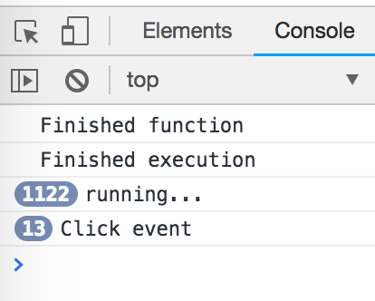

# Snippets


### Check Existence of Function Parameters
```js
function someFunction(parm1, parm2, parm3) {
    if(typeof parm1 !== 'undefined') {
        // parm1 exists
    }
}
```
> This is recommended over `if(parm1 !== undefined){}`

----------------------------------

### Performant `for` Loop

--- 

### Ternary Operator
###### Longhand
```js
var x = 20;
var answer;
if (x > 10) {
  answer = 'greater than 10';
} else {
  answer = 'less than 10';
}
```

###### Shorthand
```js
var answer = x > 10 ? 'greater than 10' : 'less than 10';
```

---

### Short-Circuit Evlauation Shorthand
###### Longhand
```js
if (variable1 !== null || variable1 !== undefined || variable1 !== '') {
  var variable2 = variable1;
}
```

###### Shorthand
```js
var variable2 = variable1  || 'new';
```

---

### Declaring Variables
###### Longhand
```js
var x;
var y;
var z = 3;
```

###### Shorthand
```js
var x, y, z = 3;
```

---

### Short-circuit Evaluation
###### Longhand
```js
let dbHost;
if (process.env.DB_HOST) {
  dbHost = process.env.DB_HOST;
} else {
  dbHost = 'localhost';
}
```

###### Shorthand
```js
const dbHost = process.env.DB_HOST || 'localhost';
```

----------------------------------

### Working with Arrays
#### `forEach`
Syntax
```js
arr.forEach(function callback(currentValue[, index[, array]]) {
    //your iterator
}[, thisArg]);
```
> There is no way to stop or break the .forEach() iterator. Use simple for loop instead.

Examples
```js
var arr = [1,2,3];
arr.forEach(function(element) {
  console.log(element);
});
```

```js
var arr = [1,2,3];
arr.forEach(function(element, index) {
  console.log(index + ': ' + element);
});
```

[MDN](https://developer.mozilla.org/en-US/docs/Web/JavaScript/Reference/Global_Objects/Array/forEach)

#### `map`
Syntax
```js
var new_array = arr.map(function callback(currentValue[, index[, array]]) {
    // Return element for new_array
}[, thisArg])
```
> map does not mutate the array on which it is called


Examples
```js
var arr = [1,2,3];
var newArr = arr.map(function(element) {
  return element * 2;
});
```

```js
var map = Array.prototype.map;
var a = map.call('Hello World', function(x) {
  return x.charCodeAt(0);
});
// a now equals [72, 101, 108, 108, 111, 32, 87, 111, 114, 108, 100]
```

[MDN](https://developer.mozilla.org/en-US/docs/Web/JavaScript/Reference/Global_Objects/Array/map)

#### `reduce`
Syntax
```js
arr.reduce(callback[, initialValue])
```

Examples
```js
var sum = [0, 1, 2, 3].reduce(function (accumulator, currentValue) {
  return accumulator + currentValue;
}, 0);
// sum is 6
```

Flatten an array of arrays
```js
var flattened = [[0, 1], [2, 3], [4, 5]].reduce(
  function(accumulator, currentValue) {
    return accumulator.concat(currentValue);
  },
  []
);
// flattened is [0, 1, 2, 3, 4, 5]
```

[MDN](https://developer.mozilla.org/en-US/docs/Web/JavaScript/Reference/Global_Objects/Array/Reduce)


#### Adding Multiple Arrays Together & Finding the Difference
The following code will take the sum values of arrays **a**, **b**, and **c** and subtract them from the values in array **d**, assigning those values to a new array, **e**.

```js
var a = [50,49,48,47,46,45,44,43,42,50,50,50];
var b = [50,50,50,50,50,50,50,50,50,50,50,50];
var c = [50,50,50,50,50,50,50,50,50,50,50,50];
var d = [500,500,500,500,500,500,500,500,500,500,500,500];
var agg = a.map(function(item, index) {
  return item + b[index] + c[index];
});
var e = d.map(function(item, index) {
  return item - agg[index];
});
```
> This was used for HighCharts manipulation

---


### Async
```js
function waitThreeSeconds() {
  var ms = 3000 + new Date().getTime();
  while(new Date() < ms) { }
  console.log('Finished function');
}

function clickHandler() {
  console.log('Click event');
}

document.addEventListener('click', clickHandler);

waitThreeSeconds();
console.log('Finished execution');

var a = 100 + new Date().getTime();
while(new Date() < a) {
  console.log('running...');
}
```



What happens?
1. Load page
1. Click in document
1. Waits
1. 3 seconds pass
1. console: Finished function
1. console: Finished execution
1. console: running... (1122x)
1. console: Click event

Why?
JavaScript doesn't look (execute) at the callback (event) queue until the stack is empty


----------------------------------

### Callbacks & Promises

Example 1
```js
function sync(callback) {
  setTimeout(function() {
    var res = deferred();
    callback(res);
  }, 1000);
}
function deferred() {
  return 'deferred';
}
sync(function(result) {
  console.log(result);
});
```

Example 2 - Simple Callback
```js
function getSalary(callback) {
  setTimeout(function() {
    callback(50000);
  }, 1000);
}

function subtractTax(salary) {
  return salary * 0.75;
}

function subtractRent(salary) {
  return salary - 1800;
}

function getDisposableIncome(callback) {
  getSalary(function(salary) {
    salary = subtractTax(salary);
    salary = subtractRent(salary);
    callback(salary);
  });
}

getDisposableIncome(function(salary) {
  console.log(salary);
});
```

Example 3 - Callback Hell
```js
function getSalary(callback) {
  setTimeout(function() {
    callback(50000);
  }, 1000);
}

function subtractTax(salary, callback) {
  setTimeout(function() {
    callback(salary * 0.75);
  }, 1000);
}

function subtractRent(salary, callback) {
  setTimeout(function() {
    callback(salary - 1800);
  }, 1000);
}

function getDisposableIncome(callback) {
  getSalary(function(salary1) {
    subtractTax(salary1, function(salary2) {
      subtractRent(salary2, function(salary3) {
        callback(salary3);
      });
    });
  });
}

getDisposableIncome(function(disposable) {
  console.log(disposable);
});
```

Example 4 - Promises
```js
function getSalary() {
  return new Promise(function(resolve) {
    setTimeout(function() {
      resolve(50000);
    }, 1000);
  });
}

function subtractTax(salary) {
  return new Promise(function(resolve) {
    setTimeout(function() {
      resolve(salary * 0.75);
    }, 1000);
  });
}

function subtractRent(salary) {
  return new Promise(function(resolve) {
    setTimeout(function() {
      resolve(salary - 1800);
    }, 1000);
  });
}

function getDisposableIncome(callback) {
  var salaryPromise = getSalary();
  var taxPromise = salaryPromise.then(function(salary1) {
    return subtractTax(salary1);
  });
  var rentPromise = taxPromise.then(function(salary2) {
    return subtractRent(salary2);
  });
  return rentPromise;
}

getDisposableIncome().then(function(disposable) {
  console.log(disposable);
});
```

Example 5 - Promises Chained
```js
function getSalary() {
  return new Promise(function(resolve) {
    setTimeout(function() {
      resolve(50000);
    }, 1000);
  });
}

function subtractTax(salary) {
  return new Promise(function(resolve) {
    setTimeout(function() {
      resolve(salary * 0.75);
    }, 1000);
  });
}

function subtractRent(salary) {
  return new Promise(function(resolve) {
    setTimeout(function() {
      resolve(salary - 1800);
    }, 1000);
  });
}

function getDisposableIncome(callback) {
  return getSalary().then(subtractTax).then(subtractRent);
}

getDisposableIncome().then(function(disposable) {
  console.log(disposable);
});
```

----------------------------------

### Promises

```js
var promiseToCleanRoom = new Promise(function(resolve, reject) {
  // do work
  var isClean = true;
  if(isClean) {
    resolve('Clean');
  } else {
    reject('not Clean');
  }
});

promiseToCleanRoom.then(function(fromResolve) {
  console.log('the room is ' + fromResolve);
}).catch(function(fromReject) {
  console.log('the room is ' + fromReject);
})
```

---


# Misc Snippets

### Performing "Work"
```js
function doWork() {
  var ms = 3000 + new Date().getTime();
  while(new Date() < ms) { }
  console.log('Finished work...');
}
```

----------------------------------
